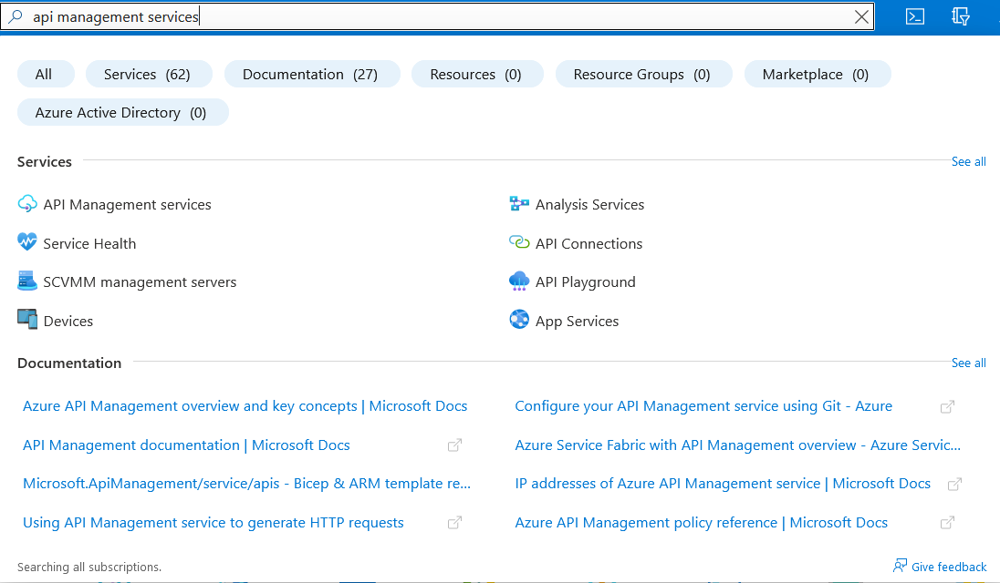
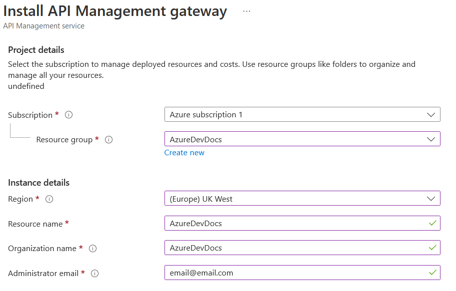

# AzureDevDocs
# API Management Service
The API management service from Azure is an extremely powerful service, which allows you to interconnect an API gateway from APIs hosted within Azure, hosted locally on-site, and other cloud service providers such as Amazon Web Services all in one single place. The service optimises API traffic flow to boost performance for both clients and servers. As an additional benefit, it also helps out with security and compliance requirements for some of the more restricted projects, while also being able to manage everything in one easy to go place.  
The API service also has capability to filter and block certain IP addresses, great for security purposes.  
You can limit the rate of API calls based on API key usage, to protect servers from being attacked.  
To find out in much more detail, visit the Microsoft official documentation [here.](https://azure.microsoft.com/en-gb/services/api-management/#security)
# Azure Free Tier Offering
Due to the nature of the service, there is NO free offering through Azure Free Services. All tiers of plan within the service are paid, each having their own separate benefits and drawbacks.
# How-to: Setup an API Management Service instance
> **Warning**  
> Due to the nature of the service, you are unable to use this service in the Azure Free Tier.  
> Please note that all tiers, including Developer, have a fixed hourly cost to utilise. I am not responsible if you incur unexpected charges.  
1. In the Azure portal, search for "API Management Service". 

2. Use an existing subscription, choose your own region, give it a meaningful name, give it an organisation name, and an email (ideally the email used to sign-up to Azure, if possible!).  
For pricing tier, simply choose Developer, as we are not creating a production-grade API.  
See below for an example deployment template:

3. Review and create.  
> **Warning**  
> Deployment will take an extremely long time - upwards of 1 hour. Be prepared to wait a VERY LONG time.  
> It is recommended to leave time for this to deploy!
