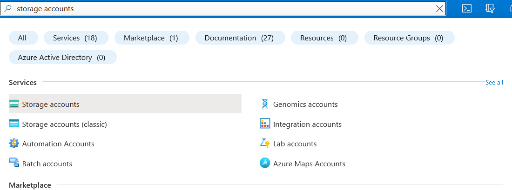
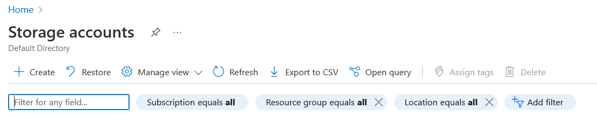
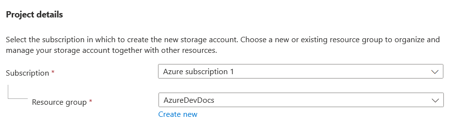
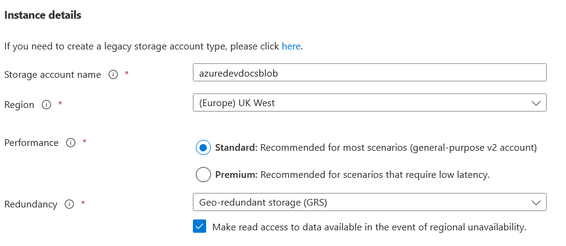
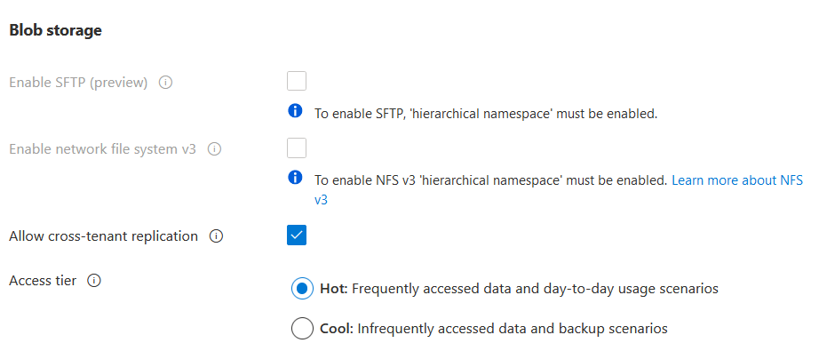
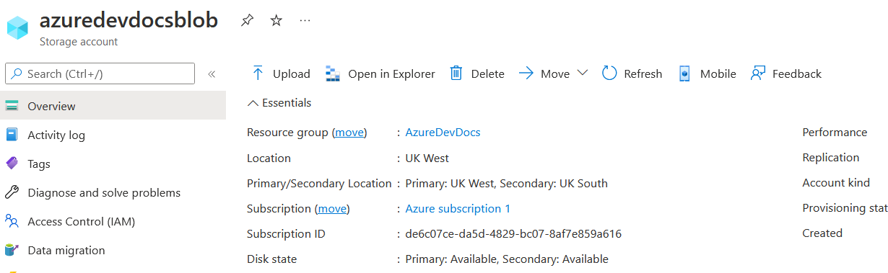
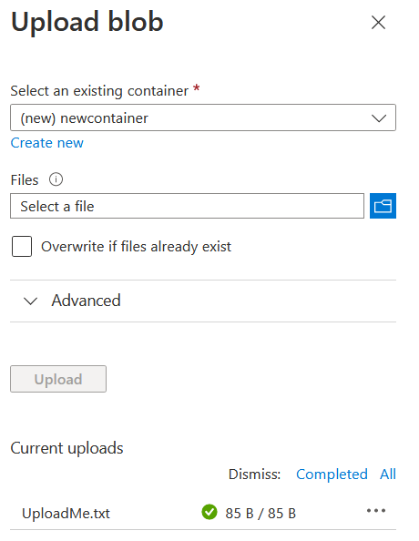
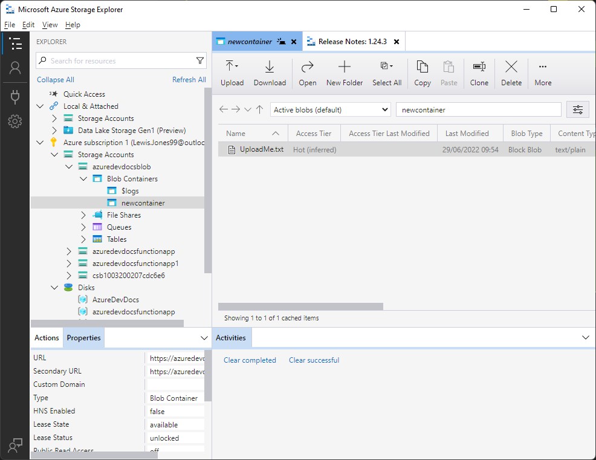
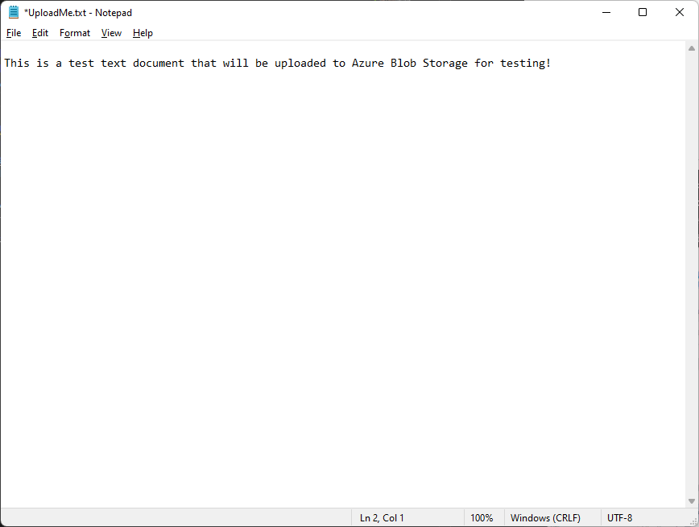

# AzureDevDocs
# Azure Blob Storage - recap
Blob containers are object-oriented storage. This means its very similar to your actual hard drive, containing data such as music, documents and pictures. There are different types of blob storage, dependent on the optimisation required.

 - Block: General use, for text and binary data. Use this one for your regular files as a backup strategy, or for use with other applications in the cloud. Made of blocks and managed individually. Maximum size is 4.75TiB.
 - Append - Optimised for append operations - updating files. Maximum size is also 4.75TiB.
 - Page  - Used for random access files. Also used for Virtual Hard Drives. Maximum size is 8TiB.
There are also storage accounts - two different versions.
You want to use V2 for the vast majority of the time, with V1 also being available for legacy applications - but it is not recommended for general use.
# Azure Free Tier Offering

 - 5 GB locally redundant storage, in the hot (discussed later) tier, with 20,000 read and 10,000 write operations.
Please note that this is only available for the first 12 months. Afterwards it becomes a paid service only.

# Blob Storage - Alternative types of storage
Within blob storage there are also other options:
 - Block blob storage - Mostly for Block and Append blobs. Has a high transaction rate, and works great with large amounts of small objects, as well as loads with a low-latency requirement.
 - File storage - Enterprise only. Premium file sharing. Only supports file store.
 - Blob storage - Legacy version of Block Blob Storage. 
# Blob Storage - Tiers of access
 
 - Premium - Optimised for low-latency operations, priced for high transactional usage.
 - Hot - Normal, default level of access. Instant access to files. Most expensive.
 - Cool - Data is archived in this tier. Data can take time to access, but is much cheaper to store.
 - Archive - Data is archived even deeper in this storage. Data can take many hours to access, but it is extremely cheap compared to Hot storage, and even cold storage.
# How-to: Create a new Hot storage blob
1. In your azure console, search for "Storage Account" and click it.

2. Click 'Create' in the top left corner.

3. On this new screen, choose the following conditions:

 - Resource Group: Whichever you've created everything else in.
 - Storage account name: azuredevdocsblob (or whatever you wish)
 - Region: Region closest to you.
 - Performance: Standard
 - Redundancy: Geo-redundant storage
 - Advanced: Leave as default (In advanced, you can set whether the blob will be hot storage, or cold storage)
 - Network: Leave as default
 - Data Protection: Leave as default
 - Encryption: Leave as default
After ensuring that all of these match up correctly, press Review + Create!  

(Below settings are in the Advanced tab)

4. After creation, we want to go to the new storage account and check out how we can browse data. On the resource page, let's upload something. Click the "upload" button.

5. Upload any file. This could be a picture of your dog, or a simple text document. I've created a text document and will upload that to the blob. Click upload, and wait for the success message in the bottom right.

6. Next, we want to check out that this file has been uploaded. Click "Open in Explorer". You will need to download Azure Data Explorer if you do not have it already.
Once you have Azure Data Explorer installed/open, the left hand column should have your Azure subscription. Here you can find your new storage, blob container and hopefully your document!

7. Double click your document to download it, and then if its a text document, it should open in notepad as below. We have successfully uploaded a file to Blob storage!

# Documentation
[Microsoft Azure Blob Storage](https://azure.microsoft.com/en-gb/services/storage/blobs/)  
[Blob Storage Pricing](https://azure.microsoft.com/en-gb/pricing/details/storage/blobs/) - Worth a look to see the vast price differences between Hot, Cold and Archive!  
[Introduction to Blob Storage](https://docs.microsoft.com/en-us/azure/storage/blobs/storage-blobs-introduction)
