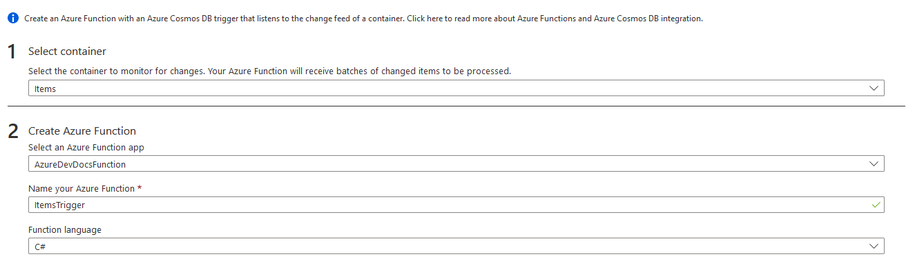
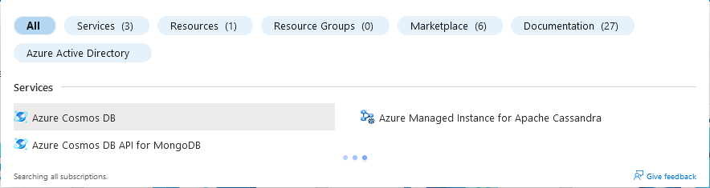

# AzureDevDocs
# CosmosDB - recap
CosmosDB is the Microsoft offering of a non-SQL database. These databases are non-relational, meaning that there are no relationships between data points, such as unique primary key identifiers. CosmosDB allows for backups across the world, with a multitude of options for data retention, allowing you to customise how fast the data is replicated, and whether this data is stored in a specific order.
The languages that are supported within CosmosDB are:

 - SQL
 - MongoDB
 - Table
 - Cassandra
 - Gremlin (Graph-based Databases)

# CosmosDB - Data consistency
As part of CosmosDB data redundancy, you can choose how your data is kept. The most consistent offerings are the most expensive, with little to no consistency being much cheaper.
Here is a breakdown of each of the tiers available:
 - Boundless/Stateless - A tolerable delay in data replication in other regions. The data may be inconsistent for a small amount of time. This is the default setting.
 - Consistent - The data will be stored in the exact order, but it takes some time before the data will appear.
 - Eventual - This option will sort the data in time, but the data will be out of order for a long time. 
 - Strong - Most consistent (and most expensive!) - All of the data is written into all of the instances at the same time, meaning that data will automatically be in the correct location immediately.
 # CosmosDB - Containers
 You are able to create containers within your databases. These containers can split the main database data into sections to make it much easier to read. This data could be shown as a graph, a table, or a collection. 
 Alternatively, containers can also contain code to sort the data, triggers based on how much data there is, or inform you about conflicts.
 # CosmosDB - Partitions
 Within CosmosDB, there are partitions, both physical and logical. Physical partitions are autoscaled, which has a limit of 50GB and 10,000 Request Units per Second. Logical units use the same partition key, but still gives a unique item ID.
 # CosmosDB - Methods of payment
 While the Azure Fundamentals exam covers payment and billing in general, the AZ-204 exam will need you to know which payment method is best for certain situations.
 If you have predictable workloads, you can provision a certain amount of Request Units per Second.
 If your workloads are not predictable, such as spiking at certain points, then pay as you go/Serverless is the best option. It is built for low or no traffic loads, as well as inconsistent workloads.
# CosmosDB - Programming
You can write programs within CosmosDB. These programs can be incorporated into the aformentioned containers.
All of these scripts can be executed using the Azure portal, Javascript integrated queries, or CosmosDB SQL Client SDKS.
All transactions within CosmosDB are ATOMIC - meaning they are not final unless the transaction has been fully completed. 
Performance can vary, but mostly runs on bulk data operations. 
# CosmosDB - Change Feed Notifications
The change feed is enabled by default on all Cosmos Accounts. This feed includes both inserts and updates into your container.  
There are, however, some restrictions with the Change Feed. It only stores the most recent change to a given item, so if an item is changed multiple times, you won't be able to see each individual edit - unless you document each individual edit somewhere.  
Azure functions are the easiest way to document the change feed - you are able to add a CosmosDB trigger, which means every container edit triggers the function.  
To do this, go onto your CosmosDB, and at the left-hand side, there is an "Add Azure Function" under "Integrations" option. CLick this, set the container you wish to have as a trigger, and then create the function. 

This will then integrate into an existing Azure Function App, and will trigger a log when you add to the database.
<<<<<<< HEAD
# How-to: Azure GUI browser
Creating a CosmosDB instance is pretty straightforward. To start with, we must go to the Azure search bar and search for "CosmosDB".

=======
# How-to: Azure GUI browser  
> **Note**  
> As part of the Azure Free Tier, you get the following benefits for free:   
> - 1000 Request units per second  
Account name is your choice, but make sure it is something reasonable. Note you cannot have capitalisation in your name here.  
All other settings can be left as default for now.  
Click 'Create' to launch the DB. It may take a long time to create the database, due to the nature of the system.  
Once deployment is complete, you can click "Go to Resource" to be presented with a first-time setup wizard.  
We firstly want to click "create items container" as this will automatically create our new container for us, with the RU/s preset to 400 (note, you get a maximum of 1,000 RU/s combined in free tier).
  
# How-to: Azure CLI/Cloud Shell 

 
