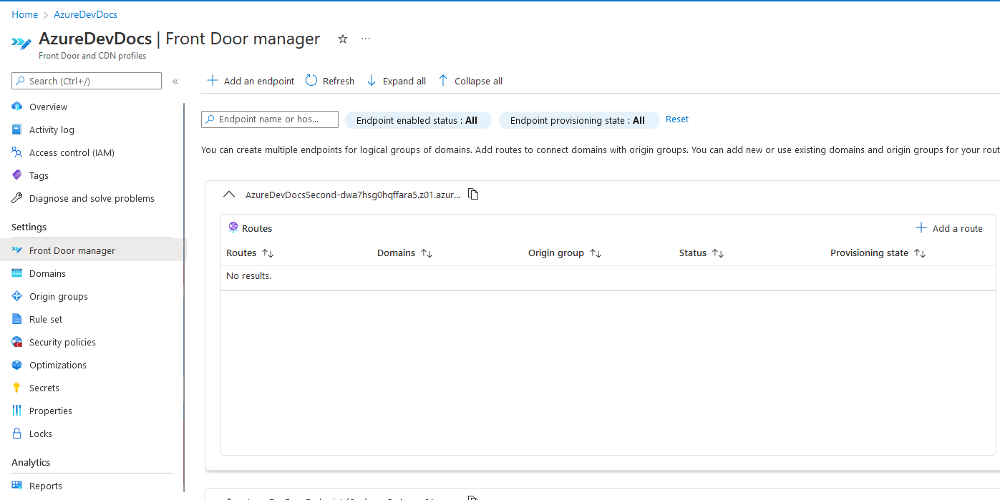

# AzureDevDocs
# Azure Front Door and CDN  
Has your product gone global? Do you have clientelle all over the world that use your site? Azure Front Door is for you. Cache your site in regions all over the world, to allow quicker accessibility to your website for everyone. Utilising the power of Azure, allow your clients and employees globally to connect faster to your services.  
Content Delivery Networks allow you to georeplicate your site in many more regions than are available through regular, conventional deployments, including regions that aren't normally available to deploy to in Azure. It is an expensive endeavour, but potentially worthwhile for a growing business.  
There are two tiers available:  
- Standard:
- Static and Dynamic content acceleration, global load balancing, SSL offload, domain & certificate management, enhanced traffic analytics, and basic security capabilities.
- Premium:
- Same as Standard, but adds extensive security capabilities, bot protection, Azure Private Link support, integration with Microsoft Threat Intelligence and security analytics. 
# How-to: Azure GUI/Portal  
> **Info**  
> There are no current free features for Azure Front Door/CDN. There is a flat $35 charge (divided hourly) per month for Standard and $335 for Premium. 

Before setting up a front door, you will need to have at least a blob storage, static web app or alternate hosted product to be distributed globally.  
Firstly, you must create a new profile:  
It is recommended that you choose Standard tier to avoid extremely heavy charges.

For the endpoint, set a name that you wish, and choose your origin type - whether it is a storage account, web app or other listed product.  
  
Once this is done, review and create your Azure Front Door.  
Once deployment is complete, your website is now fully global. To add an additional Endpoint, you can go into the Front Door Manager tab.  
  
Clicking "Add an Endpoint", and then specifying a new subdomain, will allow you to create new further routes.  
Adding a new route will allow you to specify subdomains and extra URLs to redirect to other certain URLs. For example, you could create a new URL AzureDevDocs.azurefd.net/redirect that then redirects you to another URL.  

# How-to: Azure CLI  
The CLI has many different commands available, depending on what you want to do with the CLI. Here are some examples of what you can do with the CLI:  

Manage your Front Door Backend pools:
```shell
az network front-door backend-pool
```  
Add a new backend to a Front Door Backend pools:
```shell
az network front-door backend-pool backend add
```
Purge content from an endpoint:
```shell
az network front-door purge-endpoint
```
Create a WAF policy:
```shell
az network front-door waf-policy create
```  
# Documentation
There are plenty of documents available to help with Azure Front Door and CDN. Here's some!  
[Microsoft Docs - Azure Front Door Overview](https://docs.microsoft.com/en-us/azure/frontdoor/front-door-overview)  
[Microsoft Azure - Front Door and CDN](https://azure.microsoft.com/en-us/services/frontdoor/)  
[YouTube (Microsoft Azure) - What is Azure Front Door?](https://www.youtube.com/watch?v=-4FQYxV9mAE&ab_channel=MicrosoftSecurity)