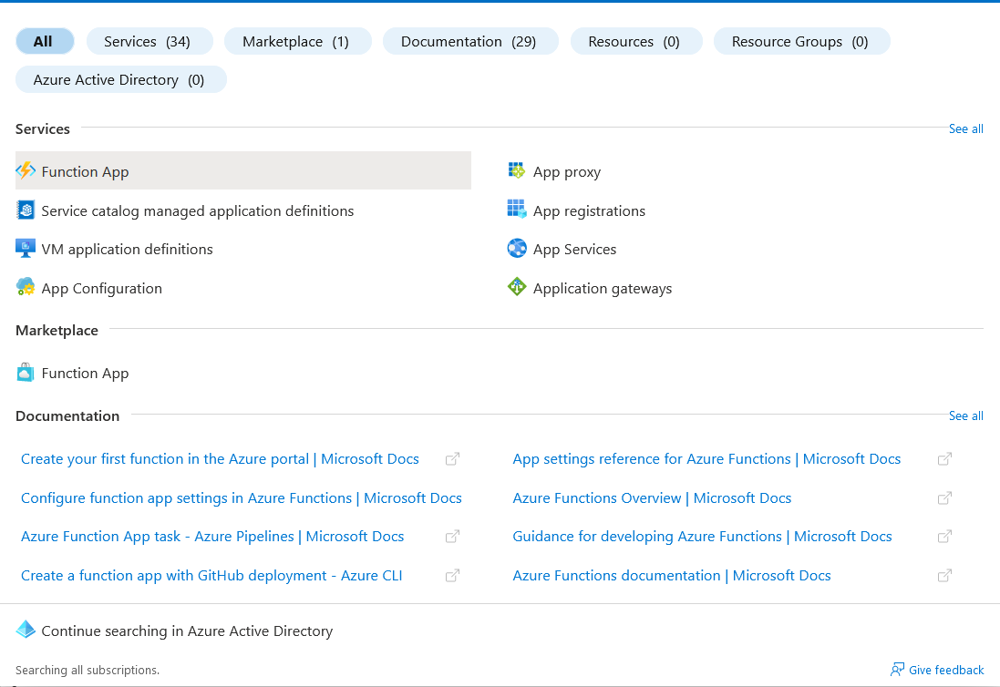
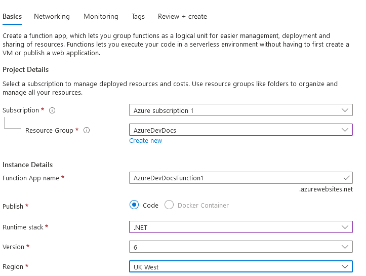
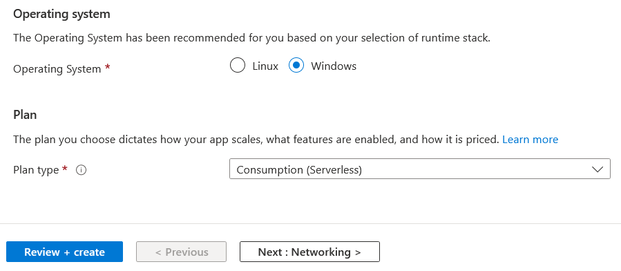
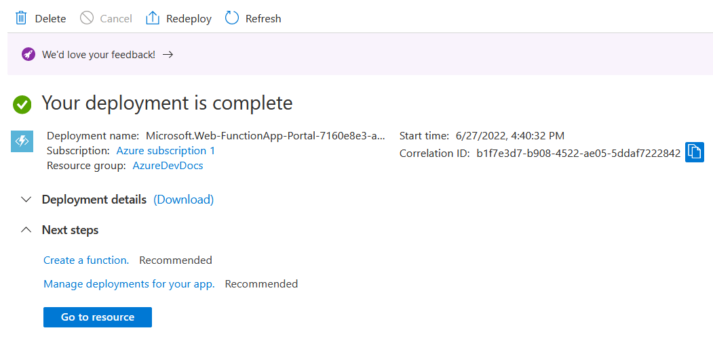
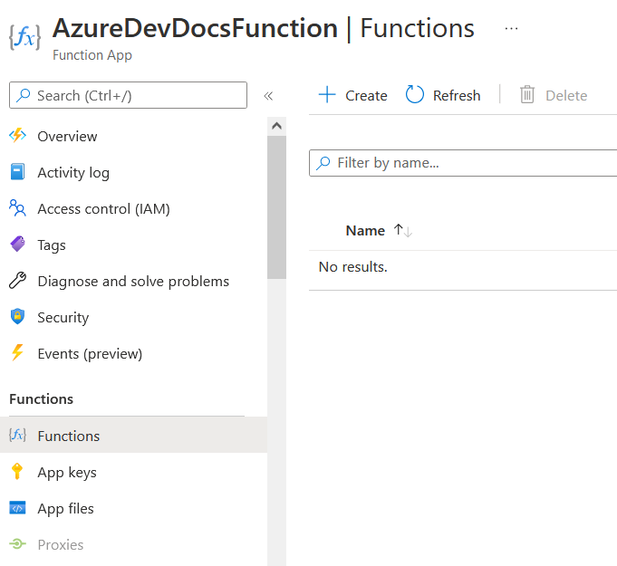
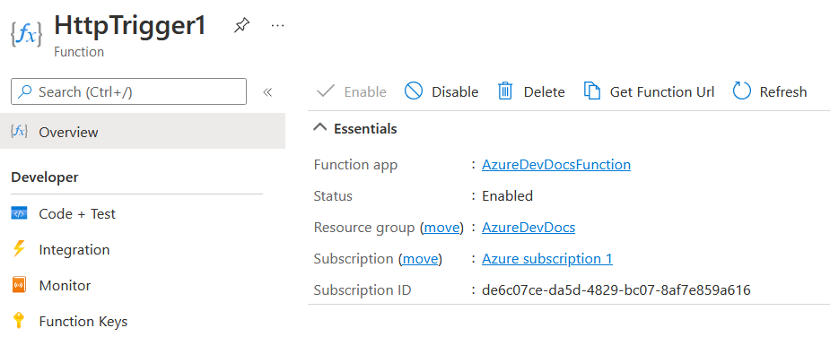
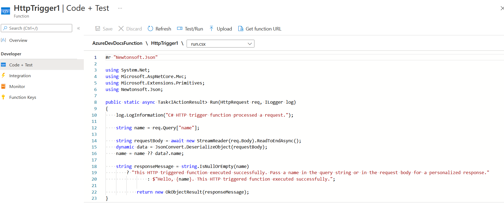
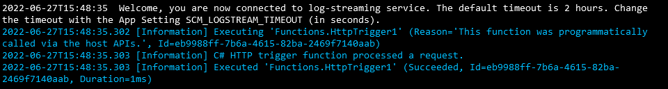

# AzureDevDocs
# Azure Functions - recap
Azure Functions is Microsoft's Serverless offering. Want to deploy an API but not worry about the underlying OS? Azure Functions are the perfect solution for this. Azure Functions makes it easy to deploy an API without the hassle of having to patch the system, provision resources and automatically scale based on demand - Functions do that for you.
# Azure Free Tier offering
Under the Azure Free Tier, you get the following:  
• 1 million requests  
That's all! You get a million refreshes a month - plenty for testing purposes!
# How-to: Azure Browser GUI
1. First, search "Function App" in the Azure console, and click the lighting symbol.

2. Next, click Create in the top left corner, to launch the Function App wizard. Use the same Resource Group you've used before, or create a new one if you haven't.  
Here is how it should be laid out:  
Runtime stack: .NET  
Version: Leave as default (6)  
Region: Whichever is closest (such as UK West)
OS: Default  
Plan: Consumption (Serverless)  

Once this is done, click review and create (the other three settings pages can be left as default) and press after validation, press create again.

3. Click "go to resource" and then in the left-hand column, choose "Functions".  

4. Press create and choose "HTTP Trigger", then create. You will get the following screen:

5. Next, click "Code and Test" on the left-hand column. In this section, you are able to reprogram using the .NET/C# Language syntax. If you don't want to make any edits, simply click "Test/Run" above the editor.

6. Click run, a mini console should appear. Click run again, and you should at least see some output. If you left it default, it should look very similar to below.

That's it! You've successfully created a basic Serverless function which responds to a HTTP trigger. For the URL, click "Get function URL", next to test/run, paste into your favourite browser and you'll get the text response.