# AzureDevDocs
# Azure Key Vault
In a lot of your applications, especially those which are connected to the internet, you will require data such as Connection Strings, API Keys and more to be stored. As these can make your app extremely vulnerable if stored incorrectly, it is important that they are stored in an encrypted manner.  
Azure Key Vault helps you with this, using enterprise grade encryption for both your generated keys as well as your secrets. You can then use links to these secrets and keys in confidence, knowing that they are fully encrypted at rest and during transit, only being decrypted at the destination where it is required.  
# Azure Key Vault - Supported types:
> **Note**  
> As part of the Azure Tier, you recieve the following benefits free of charge (for 12 months):  
> - 10,000 transactions using RSA-2048 Keys, or secrets, at the Standard tier.  

Within Azure Key Vault, you can store the following things:  
- Keys, with support for activation, expiration, RSA/EC keys, as well as tags. Key rotation also available.  
- Secrets, with a name, value and activation/expiration date. Secrets can be checked within Azure, but must have admin privileges.  
- Certificates, with support for self-signed, integrated and non integrated Certificate Authorities, with a validity period of choice. There are many settings for certificates. Note that certificates are relatively expensive.
- Access Policies: Policies can be setup for users who have access to the same key vault. This means that Administrators can prevent people from accessing keys, reading keys, creating keys etc. Limiting allows for refined control of all components.  
# Azure Key Vault - Setting up a vault
Setting up an Azure Key Vault is relatively straightforward. As usual, you can either do it through the Portal, or the command line.  
## Creating a vault in the Azure Portal
1. Firstly, in the search bar at the top, search for key vault.  
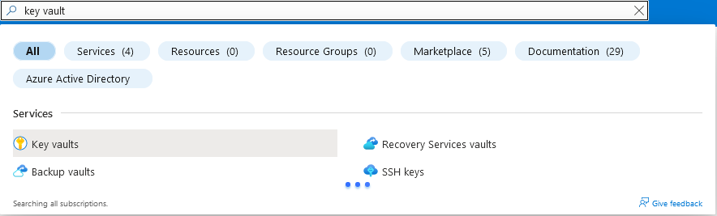  
2. On the next screen, ensure that your resource group and subscription are set to the one you've been using throughout, and then set a name. The region can be whichever, choose one close to you. Leave the pricing tier as standard, as premium is far more expensive!  
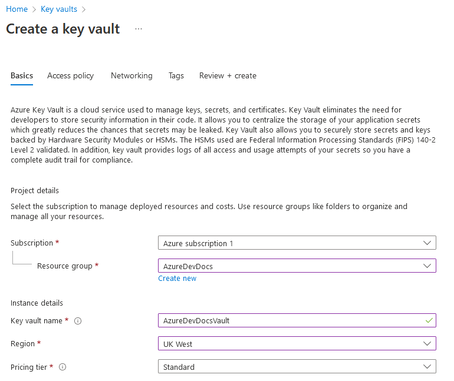  
> **Warning**  
> The next section is extremely important. This is where you can enforce purge protection of secrets/keys, ensuring they aren't deleted immediately.  
> It is highly recommended that in a production environment, you enable purge protection, as this prevents immediate loss of secrets.  
1. In terms of recovery options, set the days to retain deleted vaults to whatever you like between 7 and 90 days (the higher the better), and disable purge protection (we want to delete the vault at some point without having to wait ages!)  
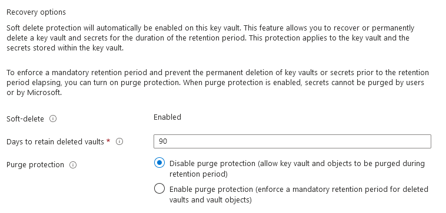  
After this, press review and create and create your Key Vault!  
## Creating a vault in PowerShell/Azure CLI
It's also relatively simple to create a vault in PowerShell or the Azure CLI. Here are some code snippets to help you in creating a key vault:  
### PowerShell
This code will deploy a new Key Vault with name AzureDevDocsVault, in the resource group AzureDevDocs, in UK West. All other options are left as default (Standard, soft delete enabled)
```Shell
New-AzKeyVault -VaultName 'AzureDevDocsVault' -ResourceGroupName 'AzureDevDocs' -Location 'UK West'
```  
[PowerShell Key Vault Docs](https://docs.microsoft.com/en-us/powershell/module/az.keyvault/?view=azps-8.1.0#key-vault)
### Azure CLI
Create a key vault using the autogenerated parameters, similar to above.
```Shell
az keyvault create --location westus2 --name AzureDevDocsVault --resource-group AzureDevDocs
```
[Azure CLI docs](https://docs.microsoft.com/en-us/cli/azure/keyvault?view=azure-cli-latest)  

# Azure Key Vault - Adding Keys and Secrets
## Keys
Adding keys are pretty simple in Azure Key Vault.  
In your created vault, on the left hand column, there is a button in settings for Keys:  
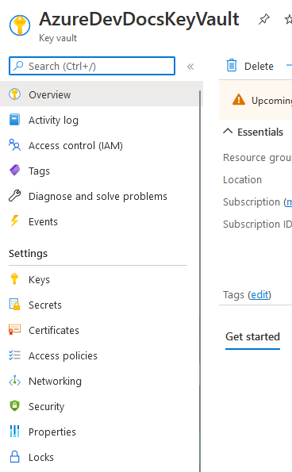  
We then want to click generate/import on the top left, where we can then get to a Create a Key screen:  
  
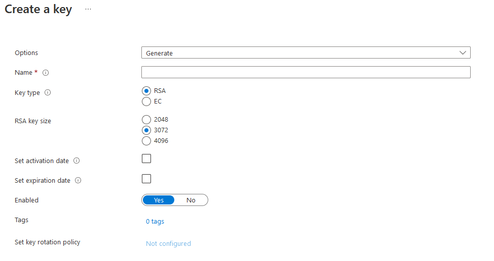  
On this screen, you can give the key a name, and then choose the type and size. Remember, for the free tier, you can only use RSA-2048 keys!  
All keys are charged for storing as well as the number of times they are requested.  
Once your key is created, it will appear on the following screen:  
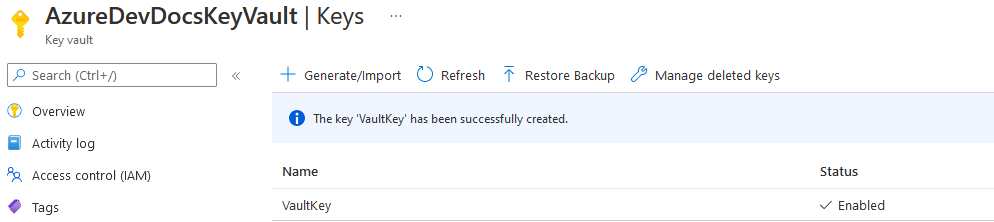  

## Keys - PowerShell/Azure CLI:
### PowerShell  
```Shell
Add-AzKeyVaultKey -VaultName 'AzureDevDocsVault' -Name 'PowerShellKey' -Destination 'AzureDevDocs'
```

### Azure CLI
```Shell
az keyvault key create --vault-name "AzureDevDocsVault" --name "CLIKey" --protection software
```

You are then able to click on the key to see the current key version, as well as the actual key.
## Secrets  
Secrets are also available within Azure Key Vault, and are just as easy to create!  
To start, similar to keys, you must find the secrets button on the left hand column:  
  
When within secrets, you can press Generate/Import, similar to before with keys.  
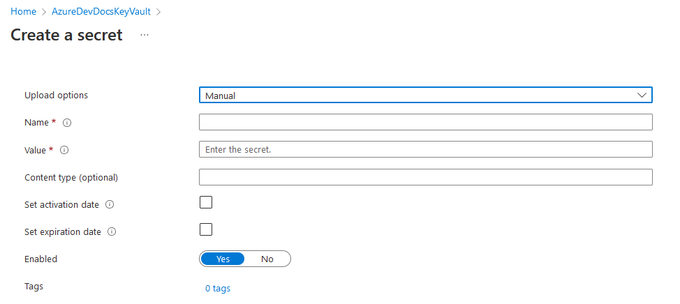  
On this screen, you can give the secret a name, a value and optional parameters. Once completed, you can then create the secret. Once your secret has been generated, it will be in the list like below:
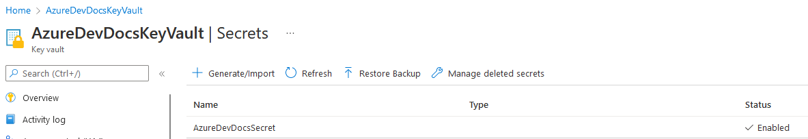  
This indicates your secret has been successfully added!  

## Secrets - PowerShell/Azure CLI:
### PowerShell  
There is no current implementation for a creating a Secret in PowerShell.  
### Azure CLI  
```Shell
az keyvault secret set --name SecretName --vault-name AzureDevDocsVault --value SecretValue
```

# Obtaining a secret in .NET - Tutorial
> **Warning**
> This tutorial will not be possible with an Azure Free Tier account, as a free tier VM will struggle to run anything.  

> **Note**
This is a more visual guide that Microsoft has provided [here.](https://docs.microsoft.com/en-us/azure/key-vault/general/tutorial-net-virtual-machine?tabs=azure-cli) The commands and code in this guide are provided by Microsoft.  

When creating a secret, it's worth checking that it's actually possible to get the secret!  
Utilising Azure VMs and the CLI we are able to do some secrets management.  
1. Firstly, if you haven't already, provision a Windows VM. I recommend a B2s tier, with 2 CPU cores and 4GB of Memory, running Windows 10, 11, Server 2016, Server 2019 or Server 2022.  
2. Remotely connect to your Virtual Machine using either SSH or RDP.  
3. Once you're in, we firstly need to install the .NET core at the link [here.](https://dotnet.microsoft.com/en-us/download)  
4. After you have installed .NET, open a Command Prompt.  
The first commands you want to type in are (run one line at a time):  
```Shell
dotnet new console -n keyvault-console-app
cd keyvault-console-app
dotnet run
```  
You should see the following prompt:  
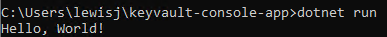  
This proves that we have successfully installed DotNet.  
5. Next, we need to install Visual Studio on the VM [here.](https://visualstudio.microsoft.com)  
6. Once installed, we then need to open Visual Studio, and then "Open a Folder". In your users folder, choose your new project that was created. The right hand column should like the following:  
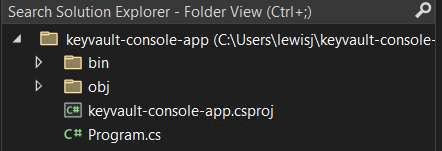  
7. Open Program.cs. You should see one line which is Console.WriteLine("Hello, World!"). We will be replacing this with the following code (CREDIT: Microsoft):
```C#
using System;
using Azure.Core;
using Azure.Identity;
using Azure.Security.KeyVault.Secrets;
class Program
    {
        static void Main(string[] args)
        {
            string secretName = "mySecret";
            string keyVaultName = "<your-key-vault-name>";
            var kvUri = "https://<your-key-vault-name>.vault.azure.net";
            SecretClientOptions options = new SecretClientOptions()
            {
                Retry =
                {
                    Delay= TimeSpan.FromSeconds(2),
                    MaxDelay = TimeSpan.FromSeconds(16),
                    MaxRetries = 5,
                    Mode = RetryMode.Exponential
                 }
            };

            var client = new SecretClient(new Uri(kvUri), new DefaultAzureCredential(),options);

            Console.Write("Input the value of your secret > ");
            string secretValue = Console.ReadLine();

            Console.Write("Creating a secret in " + keyVaultName + " called '" + secretName + "' with the value '" + secretValue + "` ...");

            client.SetSecret(secretName, secretValue);

            Console.WriteLine(" done.");

            Console.WriteLine("Forgetting your secret.");
            secretValue = "";
            Console.WriteLine("Your secret is '" + secretValue + "'.");

            Console.WriteLine("Retrieving your secret from " + keyVaultName + ".");

            KeyVaultSecret secret = client.GetSecret(secretName);

            Console.WriteLine("Your secret is '" + secret.Value + "'.");

            Console.Write("Deleting your secret from " + keyVaultName + " ...");

            client.StartDeleteSecret(secretName);

            System.Threading.Thread.Sleep(5000);
            Console.WriteLine(" done.");

        }
    }
```  
We need to change some values to information from our secret. Make sure you put in your Key Vault name (such as AzureDevDocsKeyVault).  
8. Back to our Key Vault, we need to obtain the key vault URI. On our key vault overview page, the vault URI is on the right hand side with a clipboard icon to copy to the clipboard. Insert this URI in your code.  
9. Once everything is in place, it's time to run it! Open up your command line back into the same directory, and run the code: 
```Shell
dotnet run
```  
It will prompt you for a secret, and then immediately create it, retrieve it and delete it again.  
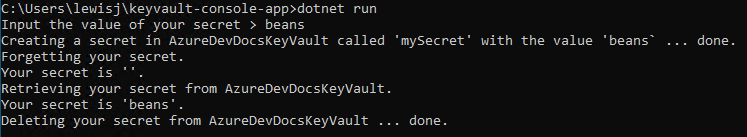  
