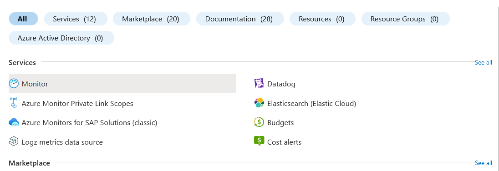
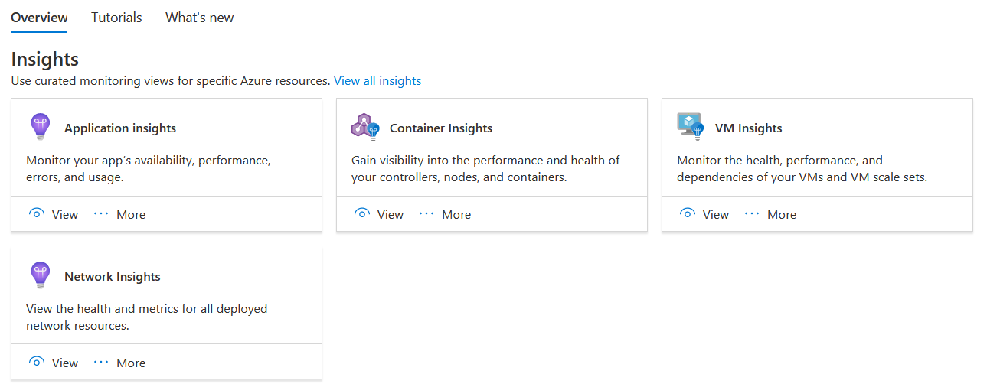
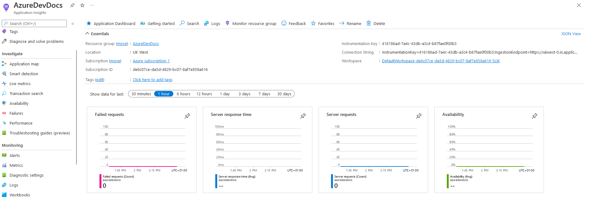
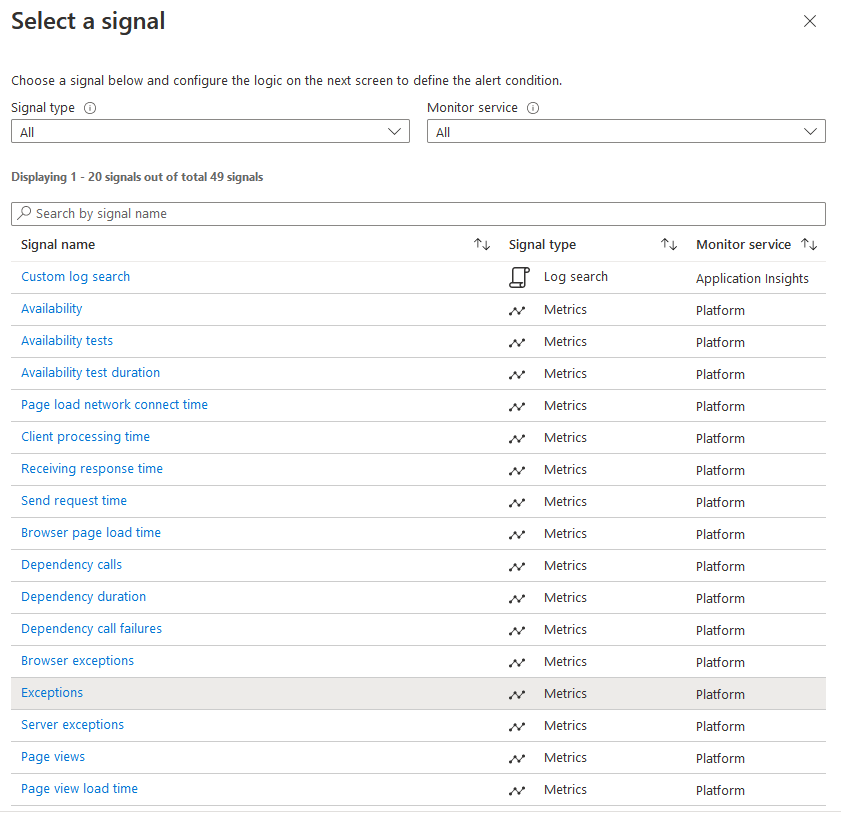
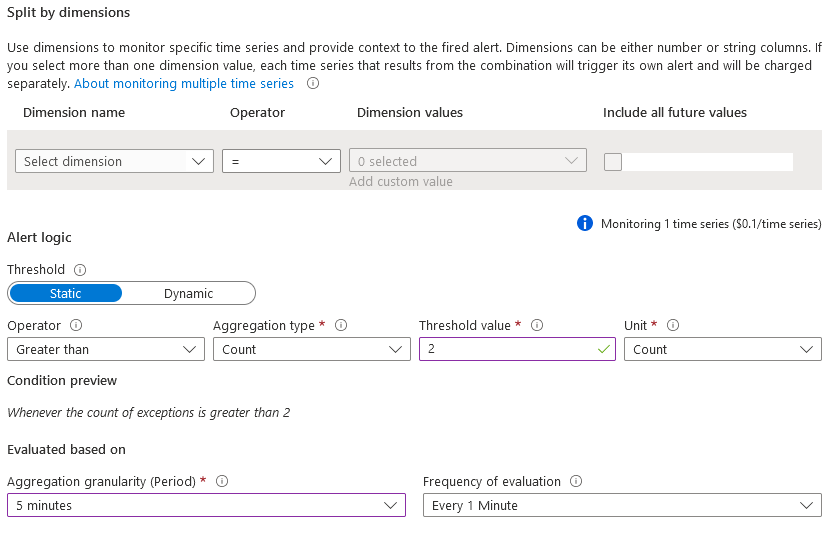
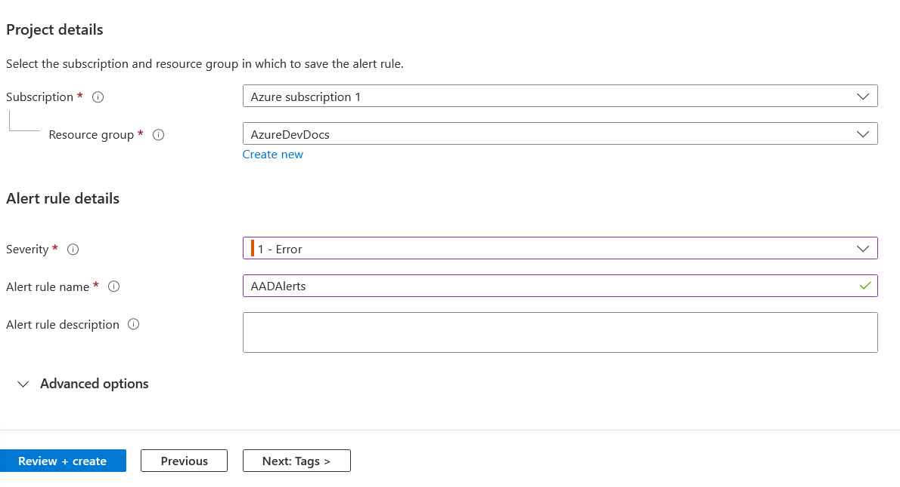

# AzureDevDocs
# Azure Monitor - Recap
Is your Azure Function being called far too often? Not enough? Is there a memory leak in one of your apps causing major issues? Azure Monitor is the tool that will help you out.  
Azure Monitor has many different aspects, including monitors for Virtual Machines, Serverless Functions, Containers and more.  
Application Insights allows you to monitor your Serverless Functions - tracking how many times it has been called, how many times it has failed, the average response time from the server, and the overall availability (where applicable).  
Using this data, you are able to create alarms using Azure Alerts, which utilise the data you get from Application Insights. Alarms can do different things depending on what has triggered it - from auto scaling in any direction, sending a notification, or simply doing nothing - it is up to you what you do with alarms!  
# How-to: Azure Monitor, including Alerts
> **Note** 
> As part of the Azure free tier you get the following:  
> - An unlimited number of Standard Metrics, on all apps.
> - 150MB per month of Customised Metrics
> - 1,000,000 standard API calls

Application insights are enabled automatically, as part of the standard metrics offering.  
To get to these metrics, search for "Monitor" in the Azure search bar.

Then choose "Application Insights".  
  
Choose whichever application you want to look at the insights for.  
For this example, I am going to use a serverless function that has already been created.  
Firstly, let's check out the Application Insights, and see how our function is performing.

Not very good! We have errors across the board, although i've only pinged the server a handful of times. It is worth pinging it a little bit more often if you want to create some more insightful metrics, but we are only doing this for an example.  
We need to be informed if there is an issue - this is where Alerts comes in. On the left hand column, there is an 'Alerts' section. Click this, and then we will be creating an 'Alert Rule'.
> **Warning**  
> There is no free tier offerings for Alerts. Alerts are billed at $0.10 per month per alert setup. Bargain for such a powerful tool! Note that anything the Alert does will be billed at the standard rate.

For our example, we will be creating an Alert in our Azure Function to check for Exceptions. If there are more than 2 exceptions in a five minute period, the alert will be triggered.  
In the creation screen, the signal choice will be "Exceptions".  

The next choice we have is for the alert logic. We want to check for the number of exceptions being greater than 1 in a five minute period, polling every minute.  
  
Once completed, in the details tab, we must select a severity level.
> **Note**
> Levels 3 & 4 are information tiers.  
> **Warning**
> Level 2 is a warning tier.   
> **Error**
> Level 0 and 1 are for critical and errors, respectively.  

You must also give the alert a name, and optionally, a description.
  
Click create and success! You are now monitoring whichever application you have created the monitor for.  
I recommend you test your function - try and get some errors to trigger your alert!