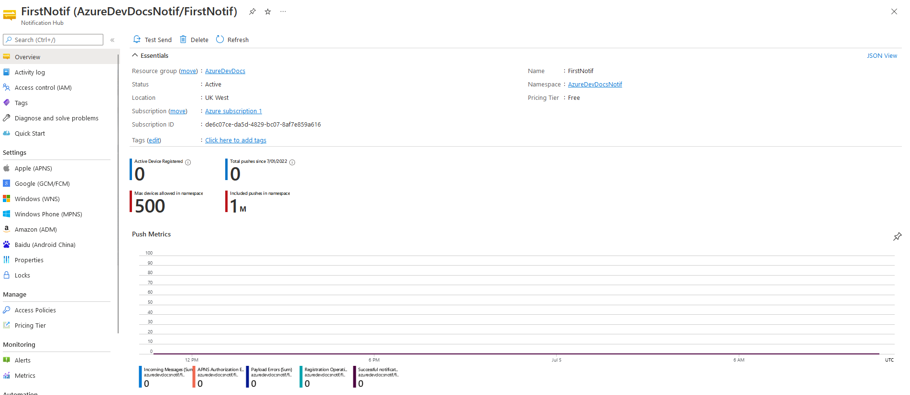

# AzureDevDocs
# Notification Hub
# Warning
> **Warning**  
> Please read this before continuing into this section.

Due to the nature of Notification Hub, information on this topic will be relatively limited. This is because it is much more difficult to demonstrate, compared to other Azure services, as it requires a fully working app to utilise. Note that this topic will be very short, and instructions on creating a Notification Hub will be omitted as it is very simple to create, but linking is more difficult but I am unable to test, and therefore verify, if my instructions would work correctly.  
For an example on how to deploy a Notification hub, see [here (Legacy Android)](https://docs.microsoft.com/en-gb/azure/notification-hubs/notification-hubs-android-push-notification-google-fcm-get-started) or [here (Current android).](https://docs.microsoft.com/en-gb/azure/notification-hubs/android-sdk)  
Note to deploy to Windows applications, you will require a Windows Developer Account, which has a charge of approximately $19 USD (as of 05/07/22) to deploy to the Microsoft Store.
# Notification Hub - Basics
> **Info**  
> As part of the Azure Free tier, you get the following benefits:
> - A maximum of 1 million pushes a month.
> - Up to 500 devices can be linked to the notification hub
> - Deploy to all platforms available
> - Utilise variables in your push notifications
> - A limited amount of telemetry data 

The notification hub is an Azure offering that allows you to utilise the power of Push Notifications in Android, iOS, Windows (UDP programs) and more, to notify the user of certain events.  
Just released a new product? Is it a national holiday and time for a sale? Use Azure Notification Hub to inform your users of these events!  
Notification Hub supports many different platforms as listed above (and more) and you can monitor your active devices on the Azure Console.  
  
Your notifications that you send can contain a message that can be specified to the customer, or a default message that everyone will see.  
Before pushing a notification to a large audience, I would highly recommend testing it on your own device - you don't want to send a notification which contains a load of gibberish that your users cannot understand!  
