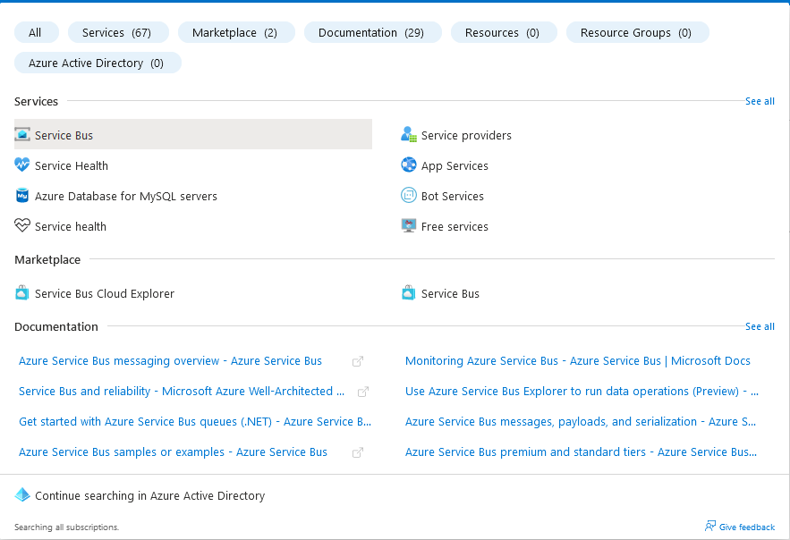
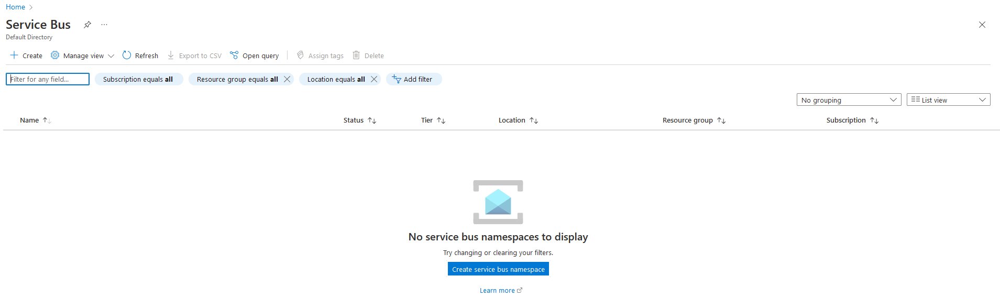
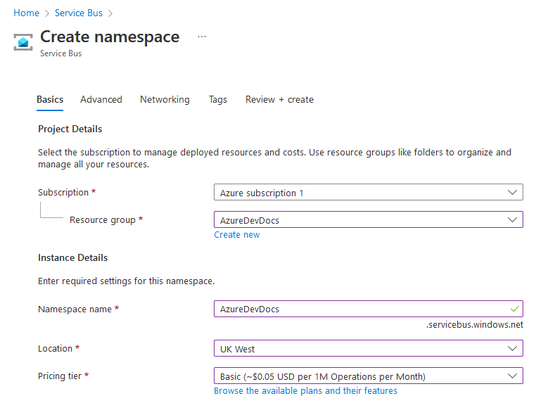
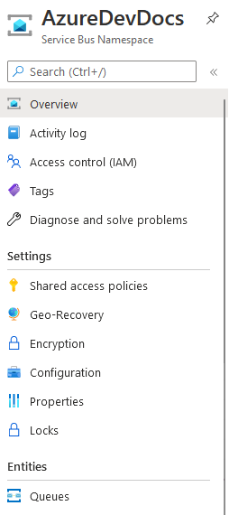
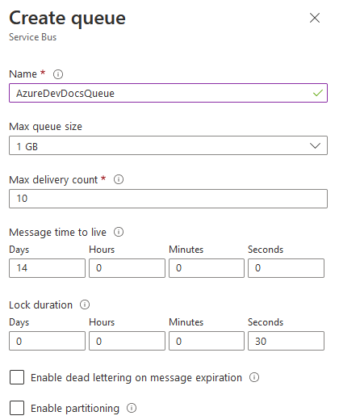

# AzureDevDocs
# Azure Service Bus
Azure Service Bus is an offering which operates like a queue system but on a larger scale. It is an enterprise scale message broker, which includes message queues, as well as publish-subscribe topics. This service allows a decoupling between an application and the main services, providing benefits such as load-balancing, safely routing the data and coordinating work with high-levels of reliability needed.  
Some common scenarios for using Azure Service Bus include regular messaging - send a customer order to another application, ready for shipping label printing, or a new user to be stored in a database, transactions following the ATOMIC model (which means that a transaction is only saved when it has been verified for completion) and using topics and subscriptions to allow subscribers to select messages from a particular stream.  
The main benefit of Service Bus over solutions from other providers is that it is Software as a service, so no more worrying about whether your hardware can cope, managing when theres a failure, or any of the underlying technologies.  
# How-to: Create a Service Bus via the Azure GUI  
To create a Service bus, we first need to search "Service Bus" in the Azure search bar.  
  
Once on this screen, we need to next choose create in the top left corner.
  
In this screen, we must give our Service Bus a resource group, name, location and tier:
 - Resource Group: One you've already created
 - Name: Whatever you wish between 6 and 50 characters, following all Azure restrictions.
 - Location: Your closest.
 - Tier:
There are three tiers available within Service bus (for this, choose basic):
   - Basic: Comes with a very limited amount of features. Costs $0.05 per 1,000,000 requests, but doesn't include features such as topics/subscriptions.  
   - Standard: Comes with most features, including topics/subscriptions, Relays, and larger messages (up to 256KB). Costs $10 per 12,500,000 responses.
   - Premium: Comes with all features, including messages up to and including 100MB, as well as more computing power available. Extremely expensive - up to 16 Messaging Units are available per instance, charged at approximately $677 per month, assuming use for 730 hours a month.

Here's what it should look like:  
  
Note you will not need to edit any other options. Simply review and create!  
Once you have created the resource, we have created a Service bus!  
The next thing we need to do is to create the queue. To do this, in your newly created resource, we can find a "Queues" section on the left hand column.  
  
In this screen, you can create a new queue. Give it a name and leave everything else as default. 
  
We have now successfully created ourselves a queue.  
If you want to test out this queue, refer to the sample folder for some javascript files, if you're comfortable already with using javascript. (These code snippets are CREDIT: [Microsoft Documentation. Click here for a full queue guide!](https://docs.microsoft.com/en-us/azure/service-bus-messaging/service-bus-nodejs-how-to-use-queues)
