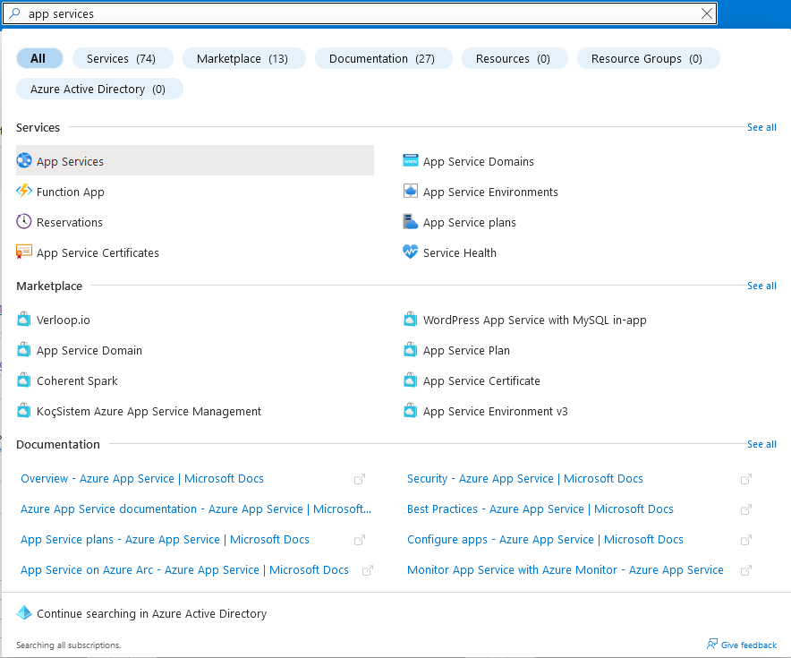
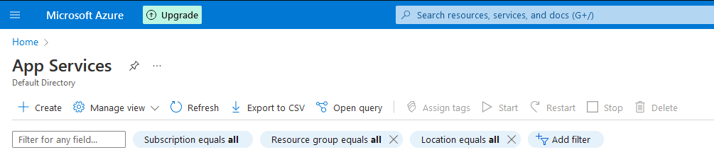
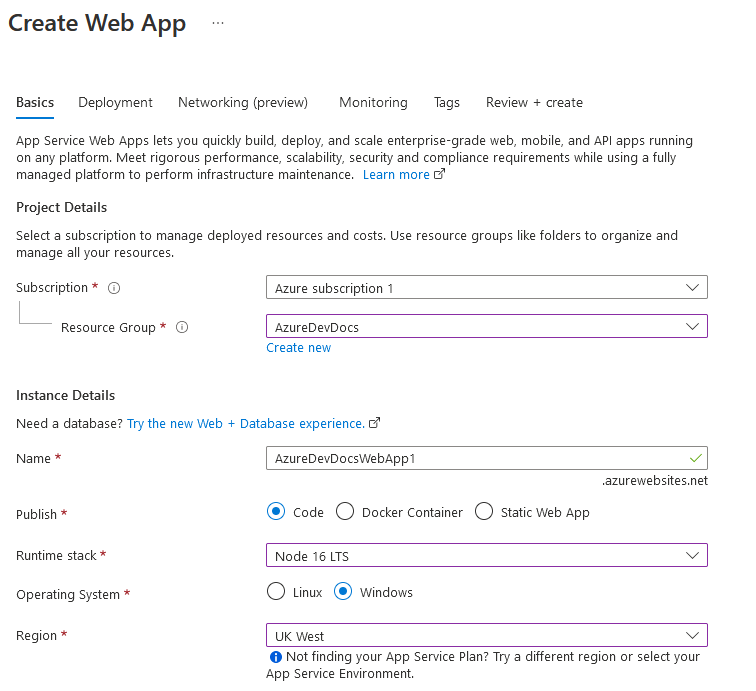
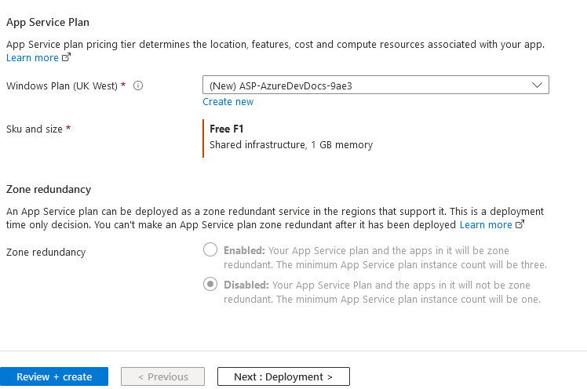
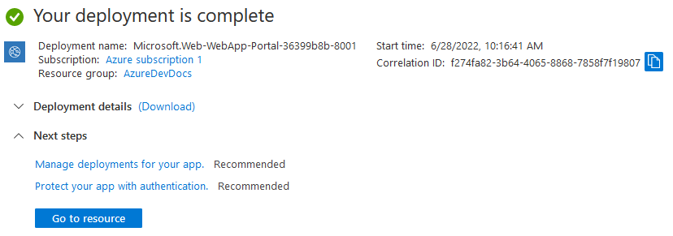
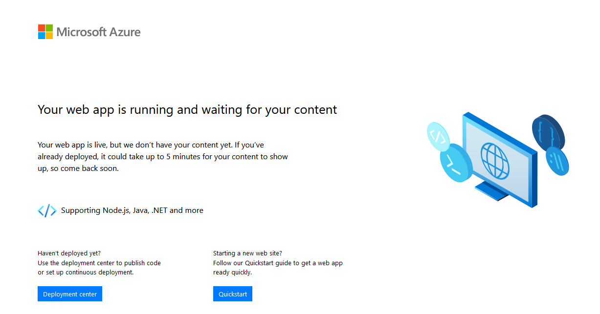
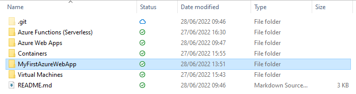
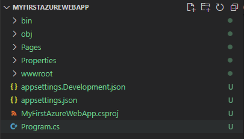
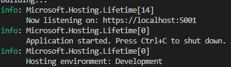
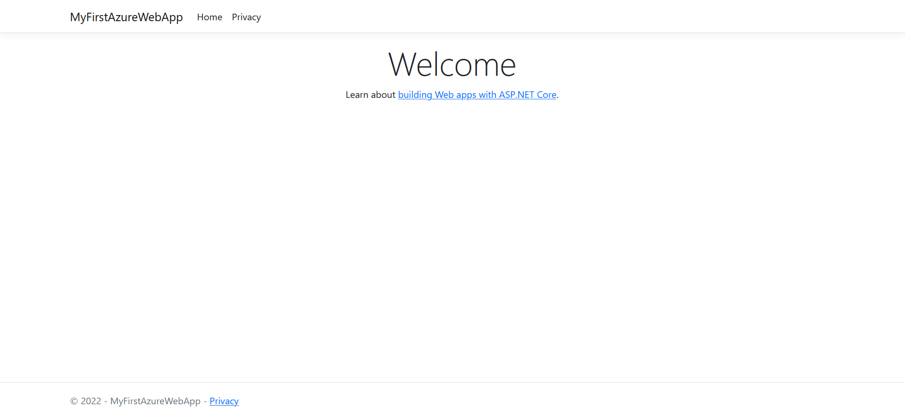

# AzureDevDocs
# Azure Web Apps - Recap
Azure Web Apps is an Azure offering which allows you to deploy your web applications in the cloud, while being able to continually maintain and update them using continuous deployment solutions such as GitHub Actions, which in turn gives users the benefit of quicker updates, better features and easy patching.  
Azure Web Apps supports a vast array of Services and platforms, including Wordpress, Umbraco, as well as Windows and Linux platforms.  
Auto-scaling both up and out & load balancing are both built-in to Azure Web Apps too.  
Azure Web Apps is a great component of running with DevOps, as it compliments both the CI/CD pipeline as well as abilities to rollback, and swapping from staging to production in seconds, rather than minutes and hours.

# How-to: GUI
> **Note**
> As part of the free tier, you recieve the following benefits:
> - Static Web App: 100GB bandwidth per subscription
> - 2 custom domains
> - 0.5GB storage per app
1. On the Azure search bar, search for "App Services".  

  

2. Once on the App Services page, on the top left, click Create.


3. Use the same subscription as before, give your instance a name (E.G AzureDevDocsWebApp).  
- Leave publish as Code.  
- The Runtime stack will be Node 16 LTS.  
- OS will be Windows (free tier eligible).  
- Region will be your choice.  

  
4. For the rest of the settings:  
- Leave Windows plan as default (Free F1 if available).
- Zone dependency is not available on our plan, so we leave it disabled.  
- Finally, review + create and create your new web app!  

  

5. Click the "go to resource" button once it is deployed.  

  

6. Click the URL to test it is working.  

  
7. Success!
# How-to: Deploying Code to a Web App
Pre-requisites: .NET 6.0 Framework [(Link)](https://dotnet.microsoft.com/en-us/download/dotnet/6.0)  
Visual Studio Code [(Link)](https://code.visualstudio.com/) 
VS Code Extension: Azure Tools 
1. In Windows Explorer, create a folder where you want this new web app to live. For this example, I have called it MyFirstAzureWebApp.  



2. After this, right click and open this folder in Visual Studio Code. Next, press control and ' (apostrophe) to open the terminal. If you have installed the pre-required framework, you should be able to run the command  
```shell 
dotnet new webapp -f net6.0
```

3. After running this command, you should see lots of files appear in the left hand pane with the folder structure.  



4. The next command is to test that its all running correctly. Run the following command in your terminal:  
```shell
dotnet run --urls=https://localhost:5001/
```

NOTE: If port 5001 is being used, you will get an error. Try another high value port number like 14819.  
You should get the following output:  

  

5. Go to your favourite browser, and type https://localhost:5001/ in your search bar. You might get a warning about certificates, simply hit advanced and proceed. You should see the following screen:  

  

6. We are now ready to deploy this shell app to Azure! First, press Control, Shift and P to open the command pallette, and search for "Azure App Service: Deploy to web app". If this does not appear, please check you have installed the Azure Tools extension.  

# How-to: Azure CLI/Cloud Shell
Basic web app creation:
```shell
az webapp create -g MyResourceGroup -p MyPlan -n MyUniqueAppName
```
Creating an app using Java 11: (Credit)
```shell
az webapp create -g MyResourceGroup -p MyPlan -n MyUniqueAppName --runtime "java|11|Java SE|11"
```
