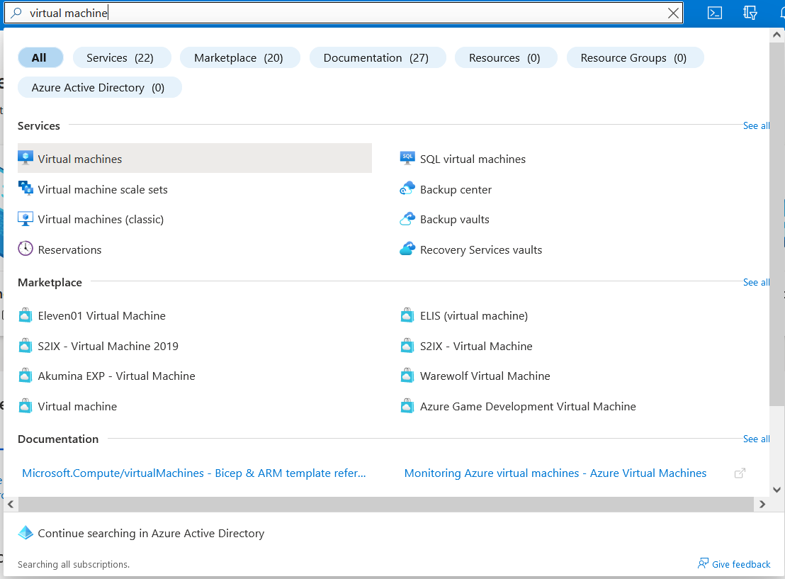

# AzureDevDocs
# Virtual Machines recap
Virtual Machines (which will be referred to as VMs from now on) are Microsoft's IaaS (Infrastructure-as-a-service) offering. Within minutes you can provision a Windows or Linux based VM, with up to 416 vCPUs and 11TB of RAM, or as little as 1vCPU and 1GB of RAM.  
Machines can come with images of Windows 10, Windows 11, Windows Server 2016, Windows Server 2019, or Linux-based systems such as Ubuntu or CentOS.  
They are best used if you need to control the environment for your server, as you will need to maintain patching and security of the VM. You are responsible for keeping people off your VM!
# Azure free tier
In the Azure free tier, you get the following benefits:  
• 750 hours per month of a Windows Server 2016/2019 B1 (1vCPU, 1GB RAM) provisioned Virtual Machine.  
• 750 hours per month of a Linux B1 (1vCPU, 1GB RAM) provisioned Virtual Machine.  
Both VMs come with 128GB Storage, which is also linked to your free tier storage.  
Note: These VMs are mostly for demonstrating capabilities, and are not recommended for actual use. Windows is incredibly unstable with 1GB of RAM!
# How-to: Azure Browser GUI
1. In the search bar on Azure, search for Virtual Machine and click it to enter the VM screen.  
   
2. On this screen, press Create in the top left corner, then Azure virtual machine.
   
3. Select your resource group. If you don't have one, create a new one and give it a name.  
   Next, give your VM a name such as FirstVM.  
   For region, choose whichever you wish - for free tier, check if it says free services eligible in brackets. In my example, I am going to choose UK West.  
   You don't need infrastructure redundancy.  
   Leave security as default, and select a Windows VM of your choice. I've gone for Windows Server 2022. See below for an example:
   
4. Next we need to set an admin username and password. This one is entirely up to you.  
Leave the public and inbound ports as default. Since we won't be leaving our VM open for too long, don't worry about locking it down.

5. For the rest of setup, leave disks, networking, management and advanced as defaults for now. Finally, review and create your VM! It will take a few minutes to create your VM.
(RECOMMENDED: By the create button, you can press "Download a template for automation". This can be super handy - I recommend downloading for future use!)  
If validation fails, review your VM, and then DEPLOY!  
6. Once you get the following screen, go to step 7.

7. At the bottom, press "Go to resource". We are now going to connect using Remote Desktop Connection (Windows) or Windows Remote Desktop (Mac, download from App Store).  
8. On this page, click connect, and then RDP. You will then see the following screen, where you will need to Download the RDP file.

9. Once downloaded, double click to open the file. You will recieve the following warning message - press connect.

(Note, if you get an error saying the VM is unavailable, right click and edit the file, and add your username to the credentials in Login settings as below. Also check if you are connected to a VPN!):

10. Accept any warnings that may pop up - and you're in! Wait for anything to load, and then you'll be presented with a familiar Windows desktop.

11. You can verify your system specs by going into task manager and going into the performance tab - you should have the same amount of cores and RAM as you chose. That's it - you've setup your first Windows virtual machine!
12. 